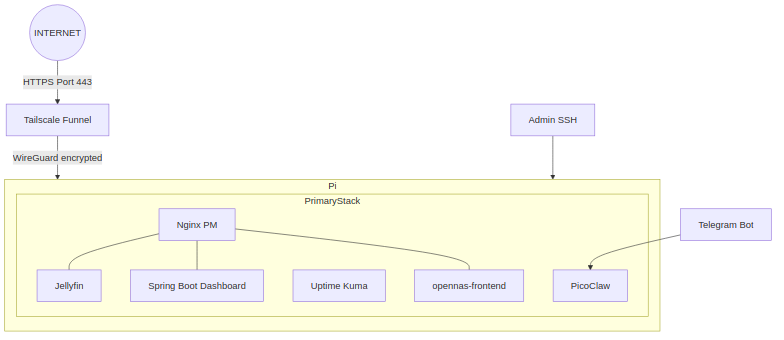
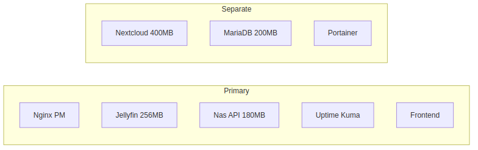
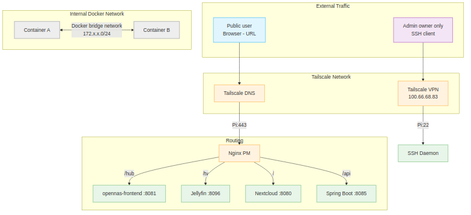
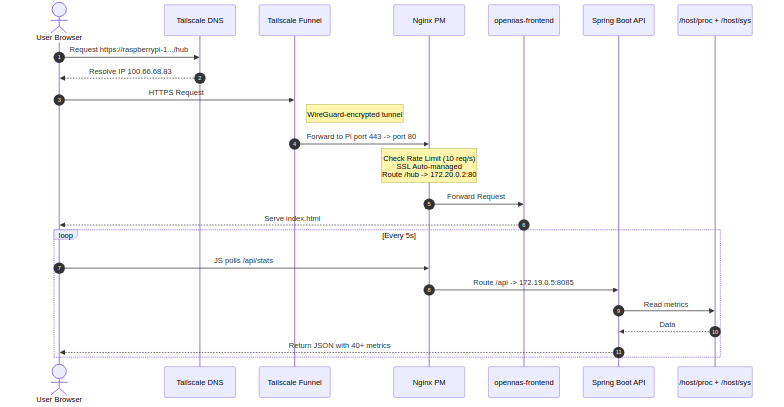
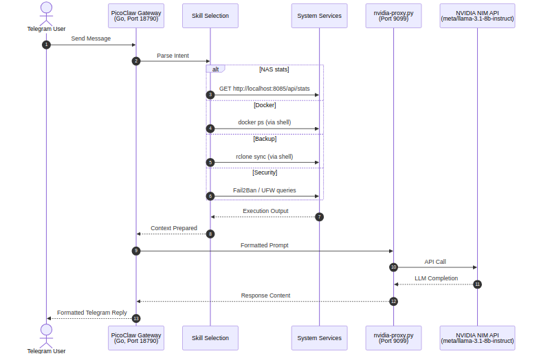
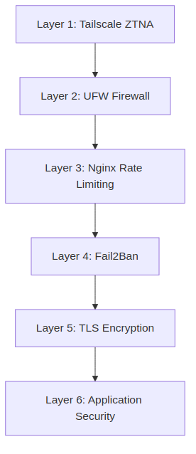
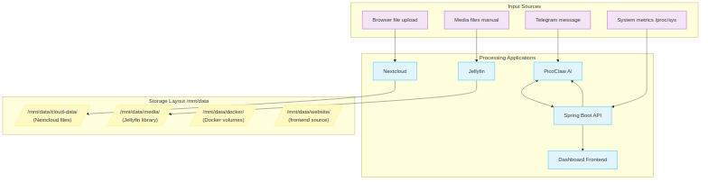
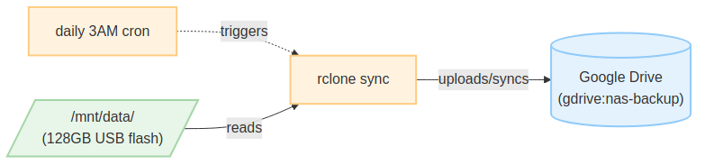
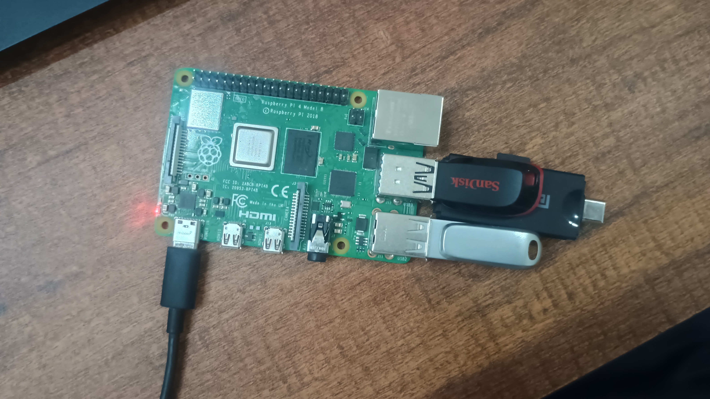
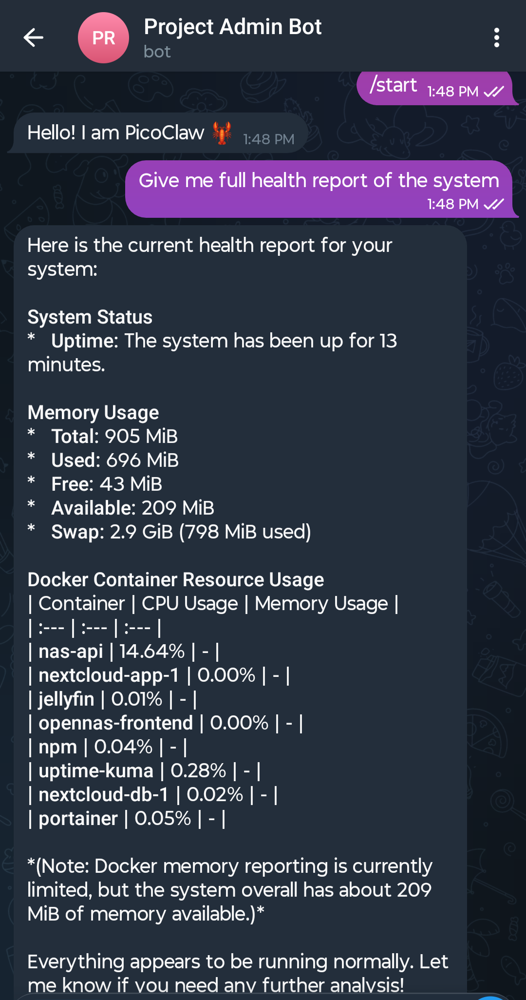

# PiCore: Edge Cloud Platform

-C51A4A?style=for-the-badge&logo=raspberrypi&logoColor=white)

> **Production infrastructure patterns on severely constrained hardware.**
>
> PiCore is a single-node edge cloud platform built entirely on a Raspberry Pi 4 with 1GB RAM. It implements containerized microservices, Zero-Trust Network Access (ZTNA), a custom hardware telemetry API, an AI agent layer (PicoClaw), and a validated chaos engineering test suite — all answering how much production engineering can fit on a ₹5,000 edge device.

---

## 📖 Table of Contents

- [Overview & Features](#-overview--features)
- [Tech Stack](#-tech-stack)
- [Architecture & Flow Diagrams](#-architecture--flow-diagrams)
- [Screenshots & UI](#-screenshots--ui)
- [Core Services Stack](#-core-services-stack)
- [Bottlenecks & Engineering Tradeoffs](#-bottlenecks--engineering-tradeoffs)
- [Comparisons: Cloud vs Synology vs PiCore](#-comparisons-cloud-vs-synology-vs-picore)
- [Directory Structure / Index](#-directory-structure--index)
- [Future Enhancements / Roadmap](#-future-enhancements--roadmap)
- [License](#-license)

---

## 🚀 Overview & Features

PiCore is an exploration of constrained edge-computing. The core features implemented are:

- **Private Cloud Storage:** File sync and sharing powered by Nextcloud & MariaDB.
- **Media Streaming Server:** Jellyfin providing movies to any device.
- **Zero-Trust Network Access (ZTNA):** Tailscale Funnel and VPN replace open ports and direct exposure.
- **AI Agent Automation (PicoClaw):** A Go-based Telegram bot integrating with NVIDIA NIM (Llama 3.1) that reports NAS stats, executes Docker commands, and sends security alerts.
- **Hardware Telemetry API:** A custom Spring Boot 3 Java backend serving over 40+ hardware metrics directly from `/proc` and `/sys`.
- **Live Observability Dashboard:** An OpenNAS frontend built to poll and visualize hardware telemetry every 5 seconds.
- **Defense-In-Depth Security:** Multi-layered security using UFW, Fail2Ban, Nginx Rate Limiting, and TLS.
- **Chaos Engineering & Resilience:** Documented fault-testing, recovery, and bottleneck analysis under high load.
- **Automated Backup:** Daily cron jobs triggering `rclone sync` to Google Drive.

---

## 💻 Tech Stack

**Backend & API**
- **Java 17 & Spring Boot 3:** Custom telemetry REST API reading from host OS.

**Frontend & UI**
- **HTML5/JS/CSS (Nginx Alpine):** Lightweight dashboard for real-time hardware status metrics.

**Infrastructure & Orchestration**
- **Docker & Docker Compose:** Container orchestration for services.
- **Portainer CE:** Container management UI.
- **Raspberry Pi OS Lite (64-bit):** Host operating system.

**Networking & Security**
- **Tailscale:** Zero-Trust Network Access & Funnel for public ingress.
- **Nginx Proxy Manager:** Reverse proxy and TLS termination.
- **UFW & Fail2Ban:** Firewall and intrusion prevention.

**Core Applications**
- **Nextcloud & MariaDB:** Private cloud and database.
- **Jellyfin:** Media streaming.
- **Uptime Kuma:** Service monitoring.

**AI & Automation**
- **Go (PicoClaw):** Lightweight agent gateway.
- **Python:** NVIDIA NIM prefix proxy.
- **NVIDIA NIM (Llama 3.1 8B):** Large Language Model for natural language interactions via Telegram.

---

## 🏗️ Architecture & Flow Diagrams

### 1. High-Level System Architecture
The foundational architecture spanning the Pi4 hardware, Docker container stacks, network routing, and Telegram AI integrations.

### 2. Low-Level Container & Network Topology
Visualizing the primary vs. separate Docker-compose stacks alongside the internal network routing handled by Tailscale & Nginx PM.

**Docker Stack Constraints:**

**Network Routing Overview:**

### 3. API Telemetry & Request Lifecycle
How a user's web request routes from Tailscale DNS through to the Java backend that parses `/host/proc` for telemetry.

### 4. PicoClaw AI Agent Integration
The interaction model between a Telegram user, the Go Gateway, local tools/scripts, and the NVIDIA NIM LLM.

### 5. Security & Defense-in-Depth Model
From outermost ZTNA down to application-layer MFA limits.

### 6. Storage & Backup Flows
How external inputs land in `/mnt/data/` and how those are synchronized with Google Drive.

**Data Flow:**

**Backup Strategy:**

---

## 📸 Screenshots & UI

*(Images showcasing the Live Dashboard, Telegram Bot interactions, Portainer, NextCloud, testing failure results and system states)*

  
  
   
  
  
   
  
  
   
  
  
   
  
  
   
  
  
   
  
  

---

## 🛠️ Core Services Stack

| Service | Purpose | Tech |
|---|---|---|
| **Private Cloud Drive** | File storage, sync, sharing | Nextcloud + MariaDB |
| **Media Server** | Stream movies | Jellyfin |
| **Reverse Proxy** | Route traffic, TLS termination | Nginx Proxy Manager |
| **AI Agent** | Telegram bot, NAS automation | PicoClaw (Go, NVIDIA NIM) |
| **Hardware Telemetry** | Live system metrics API | Spring Boot 3 (Java) |
| **Monitoring** | Uptime tracking | Uptime Kuma |
| **Container UI** | Docker UI | Portainer CE |

---

## ⚠️ Bottlenecks & Engineering Tradeoffs

PiCore deliberately pushes boundaries of a 1GB Raspberry Pi 4. Known tradeoffs include:

1. **RAM Ceiling:** ~1.14GB explicitly allocated across services limits heavy ML/AI agents directly onboard. Overflows push the Pi into using the 2GB configured swapfile, impacting speed.
2. **Flash Drive I/O limit:** SLC Cache dropoffs reduce heavy sequential file uploads to ~24.6 MB/s. Acceptable for individual usage, but unsuited for high-throughput enterprise needs.
3. **API Latency on Concurrent Load:** The Spring Boot API parses hardware stats dynamically. Testing above 20 concurrent connections exposes timeout thresholds (which is bypassed by Nginx 10 req/s rate limits).
4. **Single Node (No HA):** Designed intentionally without RAID/redundancy locally. Mitigated instead by automated nightly 3 AM Google Drive backups and fast Docker crash-recovery (`restart: unless-stopped`).

---

## ⚖️ Comparisons: Cloud vs Synology vs PiCore

| Feature / Metric | PiCore | Google Cloud (e2-micro) | Synology DS223 |
|---|---|---|---|
| **5-Year Hardware/Compute TCO** | **₹8,750** | **~₹2,40,000** | **~₹30,000+ (w/ HDDs)** |
| Data Sovereignty | Full (Your room) | None (US Datacenters) | Full (Your Home) |
| AI Agent Integration | ✅ PicoClaw + Telegram | ❌ | ❌ |
| Live Telemetry API | ✅ 40+ Metrics Custom API | ❌ | Limited |
| Setup Complexity | High (Engineering exercise) | Low (Managed Services) | Low (Commercial OS) |
| Performance Scale | Hard Capped (USB/1GB RAM) | Scalable | Medium (RAID/SATA) |

---

## 📂 Directory Structure / Index

Navigate directly to specific aspects of the project:

- **[docs/](docs/)** — **Full Documentation Suite:**
  - [01-overview.md](docs/01-overview.md) (Overview)
  - [02-architecture.md](docs/02-architecture.md) (Architecture Details)
  - [03-installation.md](docs/03-installation.md) (Installation)
  - [04-configuration.md](docs/04-configuration.md) (Configuration)
  - [05-api-reference.md](docs/05-api-reference.md) (API Reference)
  - [06-security-model.md](docs/06-security-model.md) (Security Model)
  - [07-benchmarking.md](docs/07-benchmarking.md) (Benchmarking Results)
  - [08-chaos-testing.md](docs/08-chaos-testing.md) (Chaos Engineering Results)
  - [09-bottlenecks-and-tradeoffs.md](docs/09-bottlenecks-and-tradeoffs.md) (Deep Dive into Tradeoffs)
  - [10-comparison-cloud-infra.md](docs/10-comparison-cloud-infra.md) (Full Cloud vs Synology Comparison)
  - [11-picoclaw-integration.md](docs/11-picoclaw-integration.md) (PicoClaw Integration Notes)
  - [13-troubleshooting.md](docs/13-troubleshooting.md) (Troubleshooting)
  - [14-future-roadmap.md](docs/14-future-roadmap.md) (Future Roadmap)
  - [diagrams/](docs/diagrams/) (All Mermaid generated SVG and PNG images)
- **[infrastructure/](infrastructure/)** — **Docker Compose configurations:**
  - [docker-compose.yml](infrastructure/docker-compose.yml) (Primary Core Stack)
  - [docker-compose-snippet.yml](infrastructure/docker-compose-snippet.yml) (Isolated Nextcloud Stack)
- **[spring-boot-api/](spring-boot-api/)** — [Hardware Telemetry API Backend](spring-boot-api/README.md).
- **[frontend/](frontend/)** — [OpenNAS Dashboard Source Code](frontend/README.md).
- **[picoclaw/](picoclaw/)** — [PicoClaw Go AI Agent Gateway Code](picoclaw/README.md).
- **[scripts/](scripts/)** — [Bash setup scripts and utilities](scripts/README.md).
- **[benchmarking/](benchmarking/)** — JMeter load test scripts.
- **[chaos-testing/](chaos-testing/)** — Chaos engineering disruption scripts.
- **[security/](security/)** — UFW & Fail2ban configuration references.
- **[monitoring/](monitoring/)** — Uptime Kuma references.

---

## 🔮 Future Enhancements / Roadmap

- **v1.5.0 — IoT Gateway Layer:** MQTT Broker (Mosquitto) for ESP32 nodes publishing sensor data over WiFi. PicoClaw skills for querying sensor readings.
- **v1.6.0 — AI Agent Expansion:** PicoClaw NFC Dead Man's Switch for high-risk operations (wipe, reboot). Application-layer rate-limiting in Spring Boot via Bucket4j. Add Gitea self-hosted Git.
- **v1.7.0 — Security Hardening:** WiFi Anomaly Detection parsing via ESP32. LUKS encrypted `/mnt/data` rest volume. Add Vaultwarden.
- **v2.0.0 — Multi-Node HA:** Add a secondary Pi as a replica node. Utilize Litestream for MariaDB replication and a HA proxy layer for automated failover.

---

## ⚖️ License

Distributed under the MIT License. See [`LICENSE`](LICENSE) for more information.
